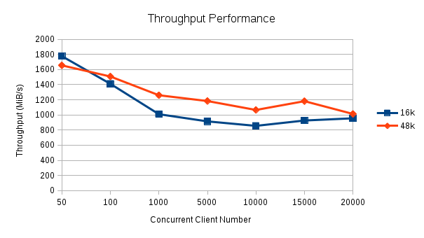
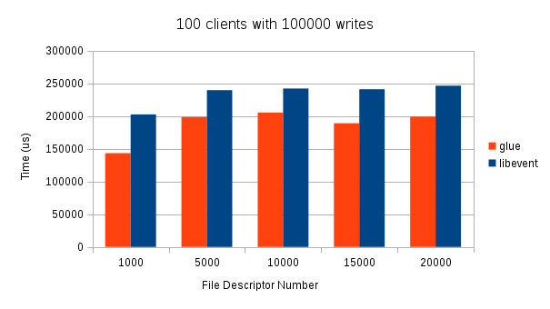
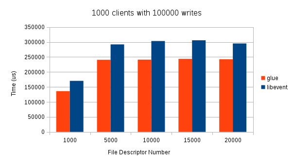

Glue
=====

A C++ network library implemented in reactor pattern.

## Purpose

The project Glue is built for three reasons: 

1. Customizing network library when building other network-related projects.
2. Sharpening my programming skills both in network programming and C++ programming.
3. Sharing the contributions that I made.

## Programming model

* Non-blocking I/O
* One epoll per thread
* Thread-pool

## Features

* Used the RAII mechanism and smart pointer to manage the lifecycle of objects.
* Used the 4-ary heap to store timers, while the delete operation or update operation of 4-ary heap could be used on any middle element efficiently, not just the top-element.
* Move any comming connection to the corresponding eventloop, so the connection-deletion could be safely and effciently.
* Support varidic-parameter logging abilities with flexible configurations.
* Support asynchronous logging.
* No need to depend on other libraries(e.g. boost), just using the C++0x with approriate g++ compiler.

## Benchmark

#### HardWare

**One Quad-Core 2.5GHz computer**

##### Throughput
The benchmark actually used a ping-pong server(2 threads) to transfer a chunk data(16K or 48K) back and forth with a ping-pong client(also 2 threads), acquire the amount of received bytes during a pre-set time range, and then compute the received bytes during one second, i.e. throughput (Bytes/s).



##### Event-Process-Time
The benchmark program is taken from the test/bench.cc from libevent source and had been modified to apply to glue.



From the chart, we can infer that glue consumed less time than libevent when starting 100 clients or 1000 clients.

## Environment required

* Linux(Version 2.6.8+)
* cmake(Version 2.6+)
* g\+\+(Version 4.8.1+) supporting C\+\+11

## Compile and run

- specify install directory for header and library

```
INSTALL_DIR=<the header and library install path that you specify> ./build.sh

Note: INSTALL_DIR should be absolute path. When no install directory specified, 
Headers would be installed into source_dir/include, while static libraries would
be installed into source_dir/lib.
```

- specify build type(debug or release)

```
BUILD_TYPE=<debug or release> ./build.sh

Note: Build type is release when not specified
```

- executable files

```
The executable files of tests for the library could be found in directory build/bin
```

## Demo

```
In directory **demo**, one echo-server and one echo-client implemented using glue, and 
compile options had been written down on the Makefile. Like this:
	g++ -std=c++0x -pthread your-program.cpp -I<the include path for glue>    \
	-L<the static library path for glue> -lglue_network -lglue_libbase -o target 
```

## Logging
Now, the logging scheme just support level setting and file setting.
Default logging configurations is level=WARN, file=out.log. To specify the level and logging file, 
you can write the content like below to the file named logger.conf.
```
level=#level num#
logger.file=#filename#
```

TODOs: Flush the file asynchronously.
